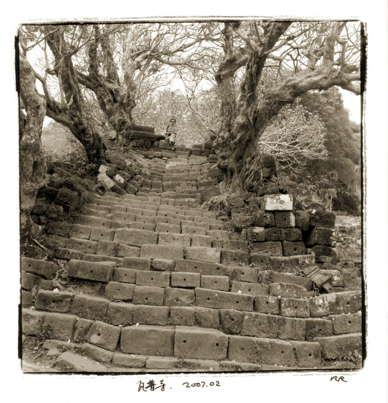
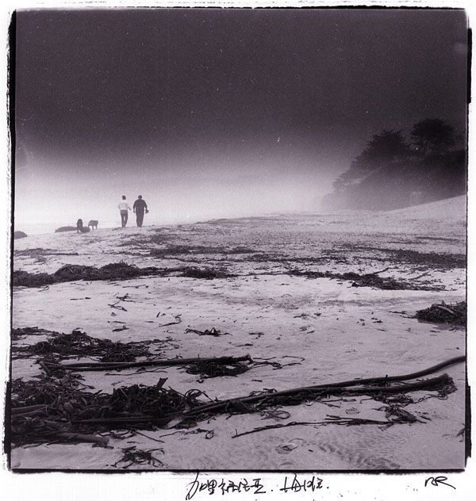
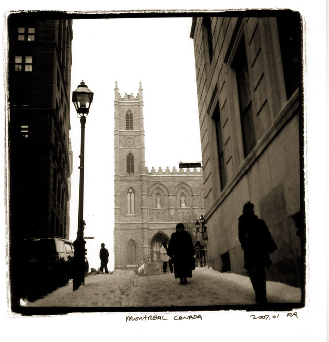

# 一个摄影师的独白

拍了一辈子照片，一辈子跌跌撞撞，从皮老虎折叠的蔡司开始走到现在，终于驻足在单反。或者严格些说，有光学取景器的相机。

喜欢光学取景器，不是因为它“老派”，不是因为它“重”，也不是因为它的画质比微单或者手机强。

而是因为它们还保留着一种正在消失的能力：它允许我用自己的眼睛，看见来自世界本身的光。某种意义上，这是摄影最原始、也最珍贵的本质。

旁轴，单反，双反，大画幅的取景玻璃，在光学取景的相机里，从被摄对象出发的光子，穿过空气、穿过镜头、最后落在我的视网膜上。

那不是数据，也不是算法，那是一种因果关系，是世界与我之间的真实接触。

而当我拿起微单、无反，甚至手机时，我看到的取景画面已经不是光，而是：传感器的电子信号，是电路的放大，是芯片的降噪，是算法的优化，是屏幕点阵的呈现。

那来自世界，直击我视网膜的光，消失了。

我看到的是机器解释过的世界。

不再需要光，不再需要天空，不再需要树
不再需要真实的脸、真实的风、真实的云

你只需要一段文字。世界就会被制造出来。

可是——

如果我没有面对世界本身，我，又在观察什么？

当一张图像可以被算法润色，被模型生成，被风格迁移重绘，那摄影就从观察变成了消费。

你不再走近对象，
你不再等待黄昏，
你不再按下快门时屏住呼吸，

因为：“反正算法可以做得更好。”

而在我卑微的认知里，那也许是一幅美妙的画面，但不是摄影。在我这个昨天时代的摄影师心里，摄影是：

光落在我眼里，风吹到我身上
世界像一只手轻触我

是哈德逊海湾畔北极熊踏破冰雪的脚步
是落基山林晨光里瑟瑟与飘落的金黄
是平遥城病困炕头的大娘攥着我的手轻轻抚摸的温暖
是南斯拉夫铁丝网围栏中被导弹摧毁的惨烈

那些场景，在我眼前一幕幕展开，
而我，在那一瞬间回应它们

AI 不懂回应，它只会在层层递进的算法中迎合。

有人说我着相，我承认。

多少读了几部佛法，抄过几卷佛经，但我还没悟出空性的真谛。

也许我太执着于光，执着于观察。
也许我太执着于人与世界之间那条微弱的因果链。

但在这个肉身越来越“无感”、观察越来越被模拟的时代，坚持这种执着，也许是一种多余的“保持清醒”。

有时候我会觉得，AI 的显现让“无自性”更加明显：世界本是空的，它只是换一种方式空给你看

但有时候我也会想，当观察与世界脱节，人类是否会逐渐失去对“真实”的能力？当影像不再是经验的延伸，而是经验的替代，人类是否会变得更空虚？

我不知道答案。

从我浅薄的佛法理解，这也许是一次大规模的示现：

色法本空
受想行识皆是假合
所见皆非真实

AI 把这些佛法原理赤裸砸在我的眼前，无法抗拒，有些悲哀：在不知不觉中，无法逆转的时代潮流裹挟着我，把我从因缘世界驱逐到算法世界。

佛法强调修行必须依色法、依真实因果。失去真实色法的观察，最终会让人失去修行的起点。

如果摄影也算一种修行，它的意义，就该来自被观察的世界，而不是被生成的图像。

因此我会用手机拍照，会用PS和Ai处理图片，但我的摄影会停在光学取景的时代。

算不上矫情和执念。这，也许是我对我认知里的摄影，最后的尊重和底线。